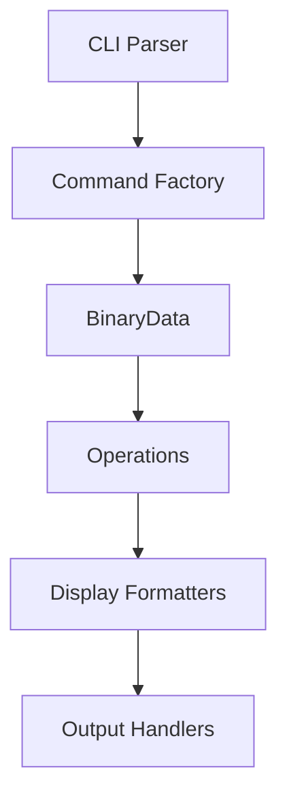

# 📜 **Binfiddle** — Binary Utilities for Developers and Hackers

*Version 0.2 | Cross-platform (Windows/Linux/macOS) | x86_64/Arm64 Support*

## 🔍 Table of Contents

1. [Overview](#-overview)
2. [Core Features](#-core-features)
3. [Installation](#-installation)
4. [Command Reference](#-command-reference)
5. [Internal Architecture](#-internal-architecture)
6. [File Handling](#-file-handling)
7. [Advanced Usage](#-advanced-usage)
8. [Error Handling](#-error-handling)
9. [Development Guide](#-development-guide)
10. [Examples](#-examples)

## 🌐 Overview

Binfiddle is a low-level binary manipulation tool designed for:
- Reverse engineers
- Firmware developers
- Data recovery specialists
- Security researchers

It is a practical, modular toolkit for developers, hackers, and engineers working with binary data. Whether you're inspecting, patching, decoding, or just fiddling with bits and bytes, Binfiddle provides flexible tools to explore and manipulate binary files with precision. Designed to be both approachable and powerful, it’s the tinkerer’s toolbox for low-level data work — no frills, just what you need to get under the hood and get things done.

Built in Rust, it combines the precision of hex editors with the flexibility of command-line tools.

> Personal note: This is a reimplementation of a very old, with poor command line, version in C (and - believe it or not - plain Bash) I created for my own needs. I have been trying to renovate my personal tooling and making them publicly available. Nowadays we have LLMs that help a lot on crafting nice documentation and assisting on converting my tools. For this reason, I greatly appreciate any feedback, bug reports, issues, feature requests and fixes and improvements.
>
> I'm also taking the opportunity to learn Rust as this is my very first Rust project.
>
> Any help is welcome and, in general, it is just a PR away ;-p


## ⚡ Core Features

### Bit-Level Precision
- Edit individual bits or byte ranges
- Custom chunk sizes (1-64 bits)
- Mixed-endian support

### Smart I/O System
- Multiple input sources:
  ```rust
  pub enum BinarySource {
      File(PathBuf),
      Stdin,
      MemoryAddress(usize), // Platform-specific
      RawData(Vec<u8>),
  }
  ```
- Adaptive memory handling (mmap for large files)

### Safety Features
- Atomic writes
- Automatic backups (`--backup` option)
- Change confirmation prompts

## 🛠️ Installation

### From Source
```bash
# Install Rust toolchain
curl --proto '=https' --tlsv1.2 -sSf https://sh.rustup.rs | sh

# Clone this git repo
git clone https://github.com/araray/binfiddle.git
cd binfiddle

# Build with optimizations
cargo build --release
```

### Cross-Compilation
```bash
# Windows target
rustup target add x86_64-pc-windows-gnu
cargo build --release --target x86_64-pc-windows-gnu

# ARM Linux
rustup target add aarch64-unknown-linux-gnu
cargo build --release --target aarch64-unknown-linux-gnu
```

## 📖 Command Reference

### Global Options
| Option         | Description                           |
| -------------- | ------------------------------------- |
| `-i, --input`  | Input source (file/stdin)             |
| `--in-file`    | Enable in-place modification          |
| `-o, --output` | Output destination                    |
| `-f, --format` | Output format (hex/dec/oct/bin/ascii) |
| `--chunk-size` | Bits per chunk (default: 8)           |
| `--silent`     | Suppress diff output                  |

### Core Commands

#### Read Operation
```rust
struct ReadCommand {
    range: String,  // Format: "start..end" or "index"
}
```
Usage:
```bash
# Read header (hex)
binfiddle -i file.bin read 0..16

# Inspect as ASCII
binfiddle -i file.bin read 0x100..0x120 --format ascii
```

#### Write Operation
```rust
struct WriteCommand {
    position: usize,
    value: String,  // Format-aware
}
```
Usage:
```bash
# Patch single byte
binfiddle -i firmware.bin write 0x1FE 90

# Bulk write from file
binfiddle -i base.bin write 0x1000 $(cat patch.bin | hexdump -v -e '/1 "%02X"')
```

#### Edit Operation
```rust
enum EditOperation {
    Insert { position: usize, data: Vec<u8> },
    Remove { start: usize, end: usize },
    Replace { start: usize, end: usize, data: Vec<u8> },
}
```
Usage:
```bash
# Insert new section
binfiddle -i rom.bin edit insert 0x8000 A1B2C3D4

# Remove corrupted data
binfiddle -i damaged.zip edit remove 0x500..0x600

# Replace checksum
binfiddle -i app.exe edit replace 0xFC..0x100 $(calc_checksum)
```

## 🏗️ Internal Architecture

### Core Data Structure
```rust
pub struct BinaryData {
    data: Vec<u8>,           // Underlying storage
    chunk_size: usize,       // Current bit granularity
    modified: bool,          // Dirty flag
    source: BinarySource,    // Origin tracking
}

impl BinaryData {
    // Critical methods
    pub fn read_range(&self, start: usize, end: Option<usize>) -> Result<Chunk>;
    pub fn write_range(&mut self, pos: usize, data: &[u8]) -> Result<()>;
    pub fn insert_data(&mut self, pos: usize, data: &[u8]) -> Result<()>;
    pub fn remove_range(&mut self, start: usize, end: usize) -> Result<()>;
}
```

### Processing Pipeline
1. **Input Phase**:
   - File memory mapping (files > 1MB)
   - Stream buffering (stdin)
   - Address space validation (memory mode)

2. **Operation Phase**:
   - Range validation
   - Endianness conversion
   - Atomic operation grouping

3. **Output Phase**:
   - CRC32 verification
   - Temp file rotation (safe saves)
   - Permission preservation

## 💾 File Handling

### Modes of Operation
| Mode          | Command     | Safety Level |
| ------------- | ----------- | ------------ |
| Read-only     | `read`      | Safe         |
| Copy-on-write | `write -o`  | Safe         |
| In-place      | `--in-file` | Dangerous    |
| Stream        | Pipeline    | Medium       |

### Example Workflows

**Safe Modification:**
```bash
binfiddle -i original.bin edit replace 0..4 7F454C46 -o modified.bin
```

**In-Place Editing:**
```bash
binfiddle --in-file -i config.dat write 0x10 FF
```

**Recovery Operation:**
```bash
dd if=/dev/sdb | binfiddle edit remove 0xBAD..0xBAD+100 -o recovered.img
```

## 🧠 Advanced Usage

### Bit Manipulation
```bash
# Set bit 3 of byte 0x10
binfiddle -i file.bin --chunk-size 1 write 0x10:3 1

# Flip nibbles
binfiddle -i firmware.hex edit replace 0x100..0x101 $(
    binfiddle -i firmware.hex read 0x100..0x101 --format hex | 
    rev
)
```

### Scripting Integration
```bash
# Automated patching
for offset in $(find_offsets "magic_value"); do
    binfiddle -i target.bin write $offset 00 -o temp.bin
    mv temp.bin target.bin
done
```

### Memory Analysis
```bash
# Live process inspection (Linux)
binfiddle -i mem:$(pidof target) read 0x400000..0x401000 -o dump.bin
```

## 🚨 Error Handling

### Error Types
```rust
#[derive(Error, Debug)]
pub enum BinfiddleError {
    #[error("I/O error: {0}")]
    Io(#[from] std::io::Error),
    
    #[error("Range error: {0}")]
    Range(String),
    
    #[error("Parse error at {position}: {details}")]
    Parse {
        position: usize,
        details: String,
    },
    // ... 8 more variants
}
```

### Recovery Strategies
1. **Automatic Rollback** - Failed writes restore backups
2. **Range Validation** - Prevents out-of-bounds access
3. **Format Detection** - Warns about binary type mismatches

## 🛠️ Development Guide

### Building Components


### Testing Strategy
```bash
# Unit tests
cargo test --lib

# Integration tests
./test_harness.sh

# Fuzzing
cargo fuzz run binary_ops
```

### Performance Tips
- Use `--chunk-size 64` for bulk operations
- Prefer memory maps for files >10MB (`MmapBytes` feature)
- Chain operations to minimize I/O:
  ```bash
  binfiddle -i file.bin \
    edit replace 0..4 7F454C46 \
    write 0x100 $(generate_data) \
    -o modified.bin
  ```

## 🧩 Examples

### Firmware Analysis
```bash
# Extract headers
binfiddle -i firmware.img read 0..16 --format hex

# Patch version string
binfiddle -i firmware.img edit replace 0x100..0x110 "v2.1.0" --format ascii -o patched.img
```

### Data Carving
```bash
# Extract JPEG from dump
binfiddle -i memory.dmp read $(($(grep -oba "FFD8" memory.dmp | cut -d: -f1)-2))..$(($(grep -oba "FFD9" memory.dmp | cut -d: -f1)+2)) -o image.jpg
```

### Binary Diffing
```bash
# Create visual diff
diff -y <(binfiddle -i v1.bin read 0..) <(binfiddle -i v2.bin read 0..)
```

---

💡 **Pro Tip**: Combine with [radare2](https://www.radare.org) for full analysis workflow:
```bash
binfiddle -i binary read $(rabin2 -S binary | grep .text | awk '{print $2,$3}') -o text.bin
```