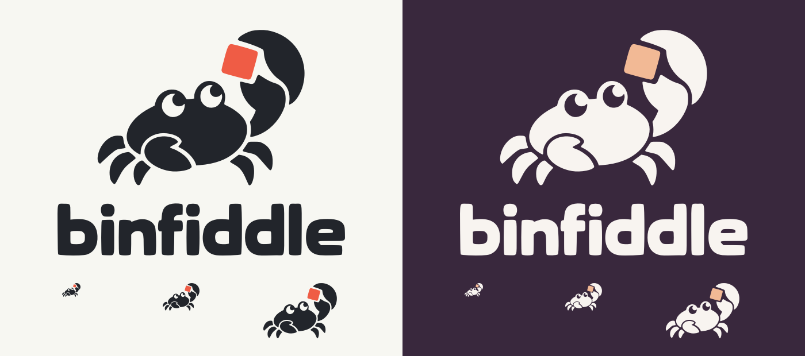

# Binfiddle artwork

The **Curious Crab** identity is based on the selected concept H. The crab
inspects a single byte, represented by the colored square.

## Assets

Each asset has matching `.svg` and `.png` versions, with `-light` and `-dark`
color treatments.

| File family | Dimensions | Use |
| --- | --- | --- |
| `binfiddle-mark-*` | 512 × 512 | Standalone crab, transparent background |
| `binfiddle-logo-*` | 1200 × 320 | Horizontal crab and wordmark, transparent background |
| `binfiddle-banner-*` | 1200 × 440 | Stacked crab and wordmark on the palette background |

Use the light mark/logo on light backgrounds and the dark mark/logo on dark
backgrounds. The project README switches between the two banners using a
`<picture>` element, with the light version as the fallback.

The SVG files contain vector paths, including the lettering. They have no
embedded raster images, external resources, or font dependencies. Preserve
their aspect ratio and the clear space around the artwork. Prefer the SVG
when resizing; the PNG files are ready-to-use raster exports.

## Palette

| Treatment | Ink | Byte accent | Background |
| --- | --- | --- | --- |
| Carbon / Ember (light) | `#22252B` | `#EF5C45` | `#F7F7F2` |
| Plum / Peach (dark) | `#F8F4F0` | `#F2B995` | `#39283D` |

Machine-readable colors and asset dimensions are in [brand.json](brand.json).

## Source artwork

- [Selected concept board](source/concept-h.png), generated with OpenAI's image tool.
- [Concept prompt](source/concept-h.prompt.txt).
- [Editable Krita master](source/binfiddle-brand-master.kra) and its
  [PNG preview](source/binfiddle-brand-master.png).

The selected silhouette and lettering were traced into curves inside Krita
through `av-krita-mcp`, preserving the concept's pose and letterforms. The
SVGs were serialized from the resulting vector layers, and the PNGs were
exported from Krita. The master includes both color treatments and mark
previews at 32, 64, and 128 pixels wide.
