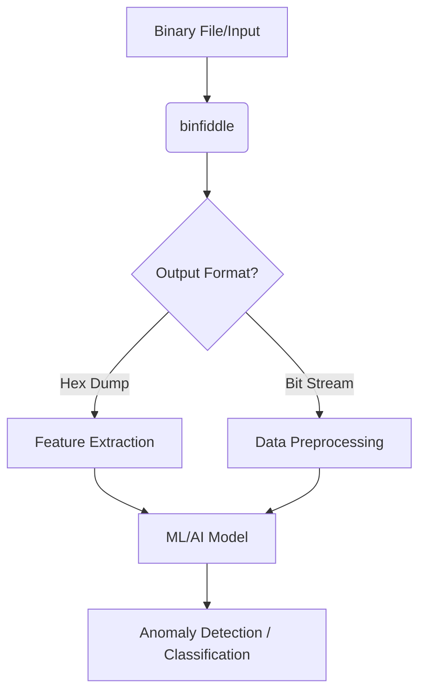

# Comparative Usage and Applications in the Command-Line Ecosystem

Binfiddle is a developer-focused binary manipulation toolkit designed to be flexible, modular, and script-friendly. It provides functionalities for inspection, patching, differential analysis, and custom exploration of binary data. Unlike many specialized tools, binfiddle is built to integrate seamlessly with existing Unix pipelines and shell scripts, enriching the overall toolchain without replacing established utilities.

> “Binfiddle is a developer-focused binary manipulation toolkit … enabling inspection, patching, differential analysis, and custom exploration” [from binfiddle's README](https://github.com/araray/binfiddle/README.md)

[TOC]

------

## Comparison with Traditional Command-Line Tools

| Tool           | Primary Function             | Pipeline Integration     | Scope & Use Case                                      | Example Fields                           |
| -------------- | ---------------------------- | ------------------------ | ----------------------------------------------------- | ---------------------------------------- |
| **xxd**        | Hex dump generation          | Excellent (stdin/stdout) | Converts binary data to hex with a fixed layout       | General inspection, reverse engineering  |
| **hexdump**    | Hexadecimal viewing          | Excellent (stdin/stdout) | Similar to xxd; used for quick dumps                  | Digital forensics, memory dump analysis  |
| **hexedit**    | Interactive binary editing   | Limited interactive mode | Editing binary files in-place                         | Patching, firmware analysis              |
| **bvi**        | Binary editing (vim-like)    | Scriptable to a degree   | Interactive, vim-like interface for binary files      | Reverse engineering, CTF challenges      |
| **radare2**    | Advanced reverse engineering | Powerful CLI, scriptable | Comprehensive binary analysis, disassembly, debugging | Malware analysis, vulnerability research |
| **010 Editor** | Binary editing (GUI-focused) | Limited CLI integration  | Detailed binary inspection with templates             | Firmware analysis, reverse engineering   |

**Binfiddle** complements these tools by offering:

- **Scriptability and Flexibility:** Seamlessly reads from stdin and writes to stdout, enabling complex pipelines and integration into shell scripts.
- **Unified Operations:** Combines tasks like inserting, removing, and replacing binary data in a single interface.
- **Customizable Output:** Offers parameters such as configurable chunk sizes (with a default of 16 chunks per line) to tailor the display for different applications.

------

## Unique Capabilities of binfiddle

- **Seamless CLI Integration:**
     Binfiddle is engineered to work flawlessly with Unix pipes, making it easy to integrate into custom workflows and automated scripts. For instance, diff-ing outputs or chaining multiple binary transformations is straightforward.
- **Modular Design:**
     Unlike monolithic tools, binfiddle’s modular approach allows users to perform specific operations (read, write, edit) without launching a full interactive session. This is especially useful when combined with other command-line utilities.
- **Enhanced Differential Analysis:**
     Its ability to process binary data and produce consistent, formatted outputs (hex, dec, oct, bin, ascii) makes it an ideal partner for tools that rely on detailed binary comparisons.
- **Script and Automation Friendly:**
     Whether used in bash scripts for firmware analysis or automated patching routines in digital forensics, binfiddle’s command-line interface is designed for integration into larger toolchains.

------

## Application Areas and Complementary Tools

### 🕵️ Reverse Engineering

- **Traditional Tools:** xxd, radare2, bvi
- **Binfiddle’s Role:** Provides a unified binary inspection and patching interface, enabling quick modifications without leaving the command line.
- **Example:** Reverse engineers can pipe a binary through binfiddle to extract and modify code segments, then analyze with radare2.

### 🔓 Hacking / Pentesting

- **Traditional Tools:** hexedit, bvi
- **Binfiddle’s Role:** Acts as an automated patching and analysis tool that can be scripted into larger penetration testing frameworks.
- **Example:** A pentester might use binfiddle within a bash script to quickly patch binaries before exploitation.

### 🛠️ Patching & Inspection

- **Traditional Tools:** 010 Editor, hexedit
- **Binfiddle’s Role:** Offers on-the-fly patching and detailed inspection via its versatile CLI, ideal for automated build pipelines.
- **Example:** Automated patch generation for software updates can incorporate binfiddle to compute differences and apply fixes.

### 🦠 Malware Analysis

- **Traditional Tools:** radare2, 010 Editor
- **Binfiddle’s Role:** Enables differential analysis of malware binaries, helping analysts identify subtle modifications between versions.
- **Example:** Malware analysts can use binfiddle to extract binary chunks and feed them into disassembly tools for further investigation.

### 🎯 Binary Exploiting (CTFs)

- **Traditional Tools:** bvi, xxd
- **Binfiddle’s Role:** Provides rapid manipulation of binary data, which is often critical in Capture-The-Flag challenges where speed is essential.
- **Example:** Competitors can quickly adjust exploit payloads in real time using binfiddle’s insert/replace operations.

### 📟 Firmware Analysis

- **Traditional Tools:** hexedit, radare2
- **Binfiddle’s Role:** Facilitates the extraction and modification of firmware images, making it easier to patch or inspect firmware binaries.
- **Example:** Researchers analyzing IoT device firmware can use binfiddle to manipulate sections of binary images for further testing.

### 🕵️‍♂️ Digital Forensics

- **Traditional Tools:** hexdump, xxd
- **Binfiddle’s Role:** Its consistent output formats and scripting compatibility help forensic analysts quickly compare memory dumps and file versions.
- **Example:** In a digital forensics investigation, binfiddle can be used to generate standardized dumps that are then compared to detect tampering.

### 💾 Memory Dump Analysis

- **Traditional Tools:** hexdump, radare2
- **Binfiddle’s Role:** Can be integrated into pipelines to automatically process and compare memory dumps, aiding in system analysis.
- **Example:** Analysts can automate the extraction of memory segments using binfiddle before feeding the data into anomaly detection tools.

### 🔧 Microcontrollers Development

- **Traditional Tools:** Various vendor-specific tools
- **Binfiddle’s Role:** Offers a lightweight command-line approach to manipulate binary firmware, useful for quick edits and patch testing in embedded systems.
- **Example:** Developers can use binfiddle to adjust firmware binaries directly before flashing them onto microcontrollers.

### 🤖 Machine Learning / AI Pipelines

- **Traditional Tools:** Custom scripts and preprocessors
- **Binfiddle’s Role:** Provides consistent, structured output (e.g., hex or bit streams) that can serve as features for machine learning models.
- **Example:** AI models can leverage the output from binfiddle to detect patterns in malware samples or anomalies in firmware updates.
    - **Integration Pipeline Diagram (Mermaid):**

Binfiddle’s consistent, scriptable outputs enable it to be easily incorporated into automated ML pipelines, where it can serve as a preprocessing step to extract binary features for further analysis. This is especially valuable in fields like malware analysis, digital forensics, and firmware security.

---

>  Binfiddle doesn’t aim to replace established command-line utilities like xxd, hexedit, or radare2. Instead, it enhances the toolkit available to reverse engineers, pentesters, malware analysts, CTF participants, firmware analysts, digital forensic investigators, memory dump analysts, microcontroller developers, and even AI/ML practitioners. By providing a modular, scriptable interface for binary manipulation and differential analysis, binfiddle fills an essential niche in the modern toolchain. Its ability to integrate seamlessly with other tools—and to serve as a bridge between raw binary data and advanced analysis techniques—underscores its value in a wide array of technical fields.

